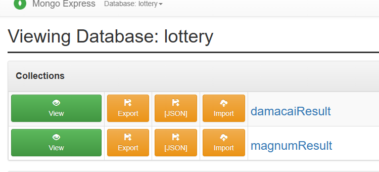
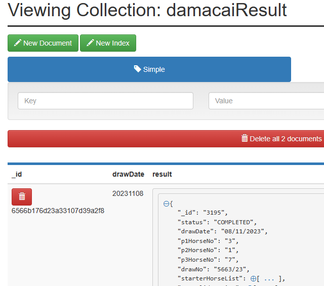

# lotteryapp
I am building a lottery app just for FUN and to solidify my Springboot and Java knowledge - keep it from being rusty.
However since this is a hobbyist app, it is not entirely built for production, although in some part I attempt keep it as best practise as possible

It uses:
- Springboot
- Spring Data JPA for mongodb
- Docker - mongodb and mongoexpress
- REST
- ~~GSON and selenium~~
- jsoup 

It has an admin and an app part. All interactions are via REST endpoints.
Admin part serves to scrap the results from the various lottery companys' website.

Damacai and Magnum both exposes their results in json thus all calls are make via requestTemplate whereas Toto does not and thus needs to be scrap using selenium

For Toto, we are using JSOUP instead of selenium. Previously Selenium was use but the simplicity of setting up JSOUP is preferred over selenium. Infact, I like how jsoup have so many different helper methods to extract the elements and the text(s) from the elements.

WHAT IS DONE:
Endpoint to scrap based on date
Endpoint to scrap based on year
Endpoint to get json of the result by date

example
http://localhost:8082/api/v1/{PROVIDER}/actions/scrap?date=20231115

http://localhost:8082/api/v1/{PROVIDER}/actions/scrap?year=2023

http://localhost:8082/api/v1/{PROVIDER}/{drawDate}

Where provider is a path variable can be replace by either MAGNUM, DAMACAI or TOTO
date is a parameter and must enter in the format YYYYMMDD
drawDate = YYYYMMDD

If installed properly with docker compose setup and after successfully ran scarp endpoint, 
One should see 2 collections

Here's an example of the Damacai Result collection of document

WIP:
endpoint to generate csv per drawdate

TODO:
endpoint to generate csv by year

Goal is have the capabilities to create a dataset that can be use for machine learning
